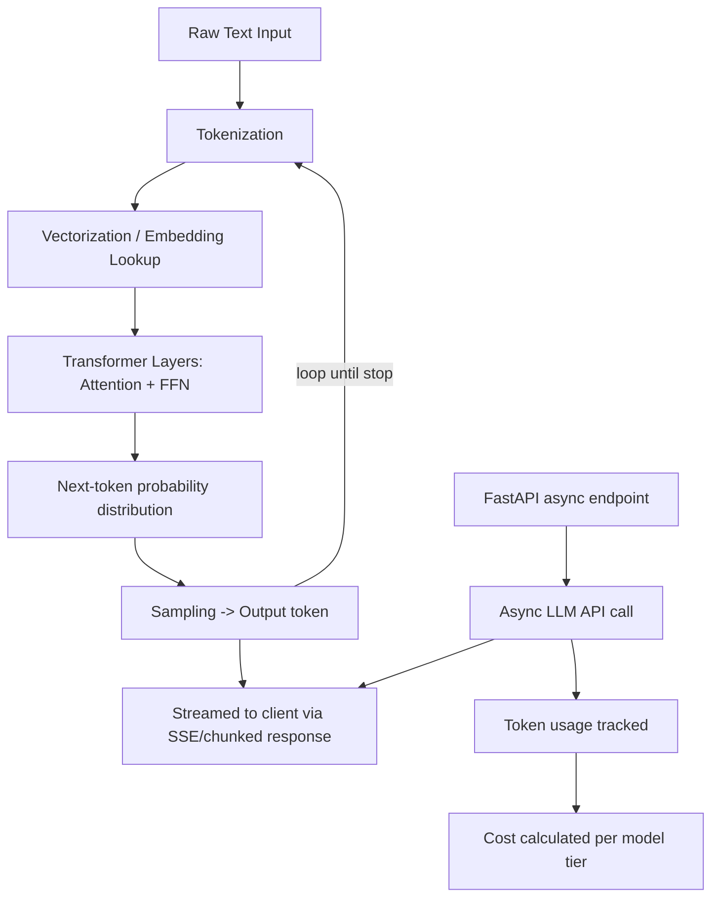
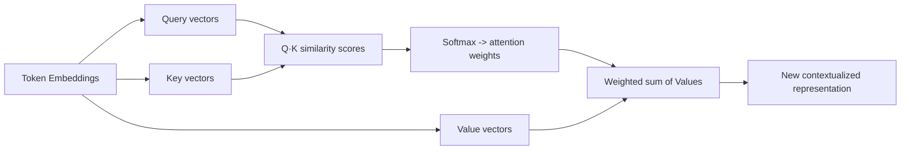
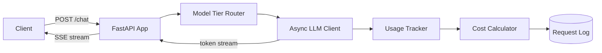

# Week 1 — Python for AI & LLM Fundamentals

## Week Objective

By the end of this week, you should be able to explain **why** LLM backends are architected differently from typical REST backends (streaming, token accounting, non-blocking I/O to a slow external dependency), and understand **what actually happens** inside a transformer well enough to reason about cost, latency, and context limits — not just call an SDK.

## Learning Map



The top row is what happens **inside** the model. The bottom row is what you **build** — a backend that calls that model efficiently and accounts for what it costs.

---

## 1. Async Python for AI Workloads

### Why It Matters
LLM calls are high-latency, I/O-bound network calls (seconds, not milliseconds). If you call them synchronously in a web server, one slow generation blocks a worker thread that could be serving other requests. This is the single most important backend-architecture difference between a normal CRUD API and an AI-serving API.

### Mental Model
An LLM call is like a slow database query that streams its rows back one at a time instead of returning all at once. You don't want to hold a thread hostage waiting on it — you want to `await` it and let the event loop serve other requests meanwhile.

### How It Works
- `httpx.AsyncClient` (not `requests`) for outbound calls to model providers.
- The official SDKs (`AsyncAnthropic`, `AsyncOpenAI`) wrap this for you.
- `async for chunk in stream:` lets you process tokens as they arrive instead of waiting for the full response.

### Practical Example
```python
from anthropic import AsyncAnthropic

client = AsyncAnthropic()

async def stream_completion(prompt: str):
    async with client.messages.stream(
        model="claude-sonnet-4-6",
        max_tokens=1024,
        messages=[{"role": "user", "content": prompt}],
    ) as stream:
        async for text in stream.text_stream:
            yield text
```

### Common Mistakes
- Using the **sync** client inside an `async def` route → blocks the event loop, defeats the entire point.
- Awaiting the full response before streaming anything to the client → you lose time-to-first-token, which is the metric users actually feel.
- Not setting timeouts on the LLM client → one hung provider call can exhaust your connection pool.

### When It Matters
Any time you're serving more than one concurrent user, or calling a model with more than trivial latency (i.e., always, in production).

---

## 2. FastAPI for Streaming LLM Responses

### Why It Matters
FastAPI's `StreamingResponse` is how you forward a token stream from the model provider to your client without buffering the whole thing server-side.

### How It Works
```python
from fastapi import FastAPI
from fastapi.responses import StreamingResponse

app = FastAPI()

@app.post("/chat")
async def chat(prompt: str):
    async def event_generator():
        async for token in stream_completion(prompt):
            yield f"data: {token}\n\n"   # SSE format
    return StreamingResponse(event_generator(), media_type="text/event-stream")
```

### Important Things to Know
- **SSE (Server-Sent Events)** is the de facto standard for LLM streaming — one-directional, text-based, works over plain HTTP, browser has native `EventSource` support.
- WebSockets are overkill unless you need bidirectional streaming (e.g., voice).
- You still need a **non-streaming fallback path** — some clients (batch jobs, evals) want the full text, not a stream.

### Common Mistakes
- Forgetting `media_type="text/event-stream"` → proxies/browsers may buffer the response instead of streaming it.
- Not handling client disconnects mid-stream → you keep burning tokens on a request nobody is listening to anymore. Check `request.is_disconnected()`.

---

## 3. Tokenization & Vectorization (Already Familiar — Level 1 refresh)

You know what these are. Here's the part that actually matters for engineering:

| Concept | AI-Engineering-Relevant Detail | Pitfall |
|---|---|---|
| **Tokenization** | Cost, context limits, and rate limits are all measured in tokens, not characters or words. ~4 chars/token in English, worse for other languages and code. | Estimating cost/context from word count instead of running the actual tokenizer → silent context overflows. |
| **Vectorization** | Every token is mapped to a dense vector (embedding) before entering the transformer — this is a **lookup**, not a computation. The interesting math starts *after* this step. | Confusing "embedding" (the static input-lookup vector) with the contextualized representation attention produces — they are not the same thing. |

**Practical detail for your build:** use `tiktoken` or the provider's token-counting endpoint to get exact counts for cost tracking — don't approximate.

---

## 4. Attention & Transformers (Core Concept — Level 3)

### What Is It?
The mechanism that lets each token's representation be updated based on *every other token in the context*, weighted by relevance — instead of processing tokens independently or only sequentially (like RNNs did).

### Why It Exists
Before attention, models (RNNs/LSTMs) processed text sequentially, which meant: (1) they couldn't parallelize training across the sequence, and (2) information from early tokens decayed by the time the model reached later ones ("long-range dependency" problem). Attention solves both.

### Mental Model
For every token, attention asks: *"Given what I am, which other tokens in this context should I pay attention to, and how much?"* Each token generates a **Query** (what am I looking for), every token offers a **Key** (what do I contain) and a **Value** (what do I actually contribute if attended to). The similarity between Query and Key determines the attention weight applied to that token's Value.

### How It Works (mechanism, not math-paper depth)



1. Each token's embedding is projected into Query, Key, Value vectors (learned linear projections).
2. Similarity (dot product) between one token's Query and every token's Key gives a raw score — "how relevant is that token to me."
3. Softmax turns those scores into weights that sum to 1.
4. The token's new representation = weighted sum of all tokens' Value vectors.
5. **Multi-head attention** runs this whole process several times in parallel with different learned projections, so different heads can specialize (one head tracks syntax, another tracks coreference, etc.), and results are concatenated.
6. This repeats across many stacked layers, each refining the representation further, interleaved with a feed-forward network per token.
7. **Causal masking** (in decoder-only LLMs like GPT/Claude): a token's Query can only attend to Keys of tokens at or before its own position — this is what makes autoregressive generation ("predict the next token") possible without cheating by seeing the future.

### Why This Matters Practically
- **Context window cost is quadratic** in sequence length (every token attends to every other token) — this is *why* long context is expensive and why techniques like KV-caching, sliding-window attention, and retrieval (RAG) exist as workarounds instead of "just use a bigger context window."
- **KV-caching**: during generation, Keys/Values for already-processed tokens are cached and reused instead of recomputed at every new token — this is why the *first* token of a response is slow (processing the whole prompt) but subsequent tokens stream fast.

### Common Mistakes
- Thinking attention "understands" text semantically like a human — it's a learned relevance-weighting mechanism, nothing more.
- Assuming longer context is always "free" performance — it costs more compute/latency and, past a point, retrieval quality *degrades* (the "lost in the middle" problem) — a preview of why RAG (Week 2) beats just stuffing everything into context.

### Interview Questions
- Q: Why can transformers train faster than RNNs on the same hardware?
  A: Attention computes relationships across all tokens in parallel (matrix ops), rather than requiring sequential processing token-by-token.
- Q: What does causal masking do and why is it necessary for generation?
  A: Restricts each token's attention to prior tokens only, preserving the autoregressive property needed to predict the next token without leaking future information.

---

## 5. LLM Lifecycle & Model Tiering (Level 2)

### What Is It?
The lifecycle of a request from prompt to response, and the practice of routing requests to different model sizes/costs based on task complexity.

### Why It Matters
This is a direct backend engineering decision, not an ML one: not every request needs your most expensive/capable model. A classification or extraction task can often run on a small, cheap, fast model; complex reasoning needs a frontier model.

### Mental Model
Think of it like read replicas vs. primary DB, or CDN edge caching vs. origin server — you route by workload characteristics (latency tolerance, complexity, cost sensitivity), not by using one tier for everything.

### Practical Example
```python
def select_model(task_complexity: str) -> str:
    return {
        "simple_extraction": "claude-haiku-4-5",
        "general_chat": "claude-sonnet-4-6",
        "complex_reasoning": "claude-opus-4-6",  # verify current model names before use
    }[task_complexity]
```

### Important Things to Know
- Tiering decisions are usually made by: task type, required latency, acceptable error rate, and cost budget per request.
- A common production pattern: try cheap/fast model first, escalate to a stronger model only if a confidence/quality check fails (you'll build proper versions of this in Week 5 and Week 8).

### Common Mistakes
- Hardcoding one model for every use case in an application — expensive and often unnecessarily slow.
- Tiering by "cost" alone without considering that a cheap-but-wrong answer can be more expensive downstream (bad extraction → bad database write → support ticket).

---

## Key Connections

- **Tokenization → Cost tracking**: you can't compute cost without an accurate token count; this directly feeds your weekly build.
- **Attention → Context limits → Model tiering**: quadratic attention cost is *why* context windows are limited and *why* not every task should default to a huge, expensive model.
- **Async Python → Streaming → FastAPI**: these three exist together because LLM calls are slow, I/O-bound, and incremental — the same reason justifies all three choices.

## 🧠 Week Memory Anchors

- Attention = Query asks, Key answers, Value delivers.
- KV-cache is why the first token is slow and the rest are fast.
- Context cost is quadratic — that's the real reason RAG will matter next week, not just "context windows are small."
- Async isn't a style preference here — sync clients in an async LLM backend silently kill concurrency.

## ⚡ 30-Second Revision

Tokens → embeddings (lookup) → attention (relevance-weighted mixing of token representations across layers, causally masked for generation) → next-token distribution → sampled and streamed back. Backend-wise: use async clients + SSE streaming because generation is slow and incremental; track exact token counts for cost; route requests to model tiers by task complexity rather than defaulting to the biggest model everywhere.

## 🎯 Interview Cheat Sheet

| Question | Short Answer |
|---|---|
| Why is attention parallelizable but RNNs aren't? | Attention computes all pairwise token relationships as matrix ops; RNNs require sequential state propagation. |
| Why does context length cost scale badly? | Attention is O(n²) in sequence length — every token attends to every other token. |
| What is KV-caching and why does it matter? | Caching Key/Value vectors for already-generated tokens so they aren't recomputed each step — enables fast token-by-token streaming after a slower first-token latency. |
| Why use `StreamingResponse` + SSE instead of returning the full completion? | Improves perceived latency (time-to-first-token) and lets clients render incrementally; users don't wait for the entire generation. |
| Why is model tiering a backend concern, not just an ML concern? | It's a cost/latency/reliability trade-off decision per request — same category of decision as choosing a cache layer or a DB read replica. |

---

# Weekly Build — The AI Gateway

## What Are We Building?
A FastAPI backend that exposes a streaming chat endpoint backed by an LLM provider, with accurate per-request token usage and cost tracking, and basic model tiering.

## Why Are We Building It?
This is the foundational service every later week's project will sit on top of (RAG, agents, evals all need a request/response layer that streams and tracks usage). Getting this right now avoids rework later.

## What We Will Learn Through the Project

| Week 1 Concept | Project Component |
|---|---|
| Async Python | Non-blocking LLM API calls |
| FastAPI + SSE | `/chat` streaming endpoint |
| Tokenization | Accurate usage accounting (input + output tokens) |
| Model tiering | `/chat` accepts a `complexity` hint that selects the model |
| LLM lifecycle | Request → provider call → stream → usage log |

## High-Level Architecture



## Main Components
1. **FastAPI app** — `/chat` (streaming) and `/chat/sync` (non-streaming, for tooling/evals later).
2. **Model tier router** — maps a complexity hint (or later, a heuristic) to a model name.
3. **Async LLM client wrapper** — thin wrapper around the provider SDK, handles retries/timeouts.
4. **Usage tracker** — captures input/output token counts per request.
5. **Cost calculator** — per-model pricing table → cost per request.
6. **Request log** — in-memory first, can swap for a real store later (you already know how to do this part).

## End-to-End Flow
1. Client sends prompt + optional complexity hint to `/chat`.
2. Router selects model.
3. Async client opens a stream to the provider.
4. Tokens are forwarded to the client via SSE as they arrive.
5. On stream completion, usage metadata (input/output tokens) is captured from the provider response.
6. Cost is computed from the pricing table and logged alongside latency (time-to-first-token, total duration).

## Implementation Milestones
1. Basic non-streaming `/chat/sync` endpoint calling one hardcoded model — confirm the async client works.
2. Convert to streaming via `StreamingResponse` + SSE — confirm time-to-first-token improves perceptibly.
3. Add token usage capture and print it after each request.
4. Add a pricing table and compute cost per request.
5. Add the complexity hint + model tier router.
6. Add basic client-disconnect handling and timeouts.

## Definition of Done
- `/chat` streams tokens incrementally to the client (verifiable via curl with `--no-buffer`).
- Every request logs: model used, input tokens, output tokens, computed cost, and total latency.
- Changing the complexity hint measurably changes which model is called.
- A hung/slow provider call does not hang the whole server (timeout in place).

## Failure Cases to Handle Later (don't build yet, just be aware)
- Provider timeout / 5xx → no fallback yet (Week 8 territory).
- Client disconnects mid-stream → should stop consuming tokens from the provider once detected.

---

Say **BUILD WEEK 1** when you're ready to start implementation, milestone by milestone.
